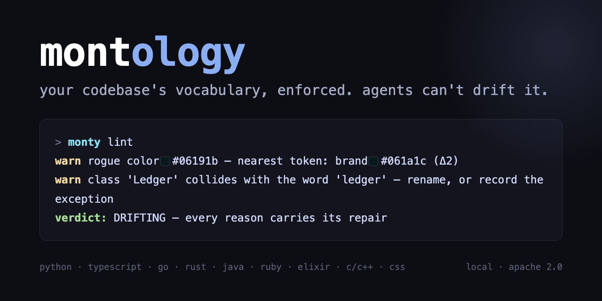
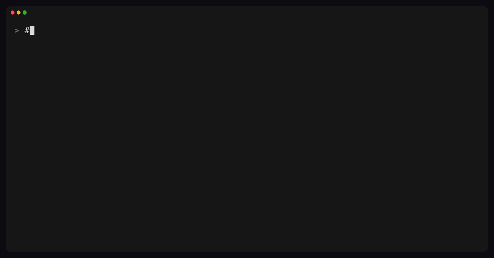
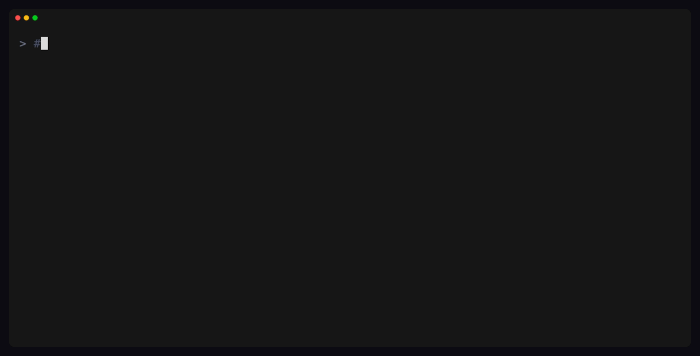
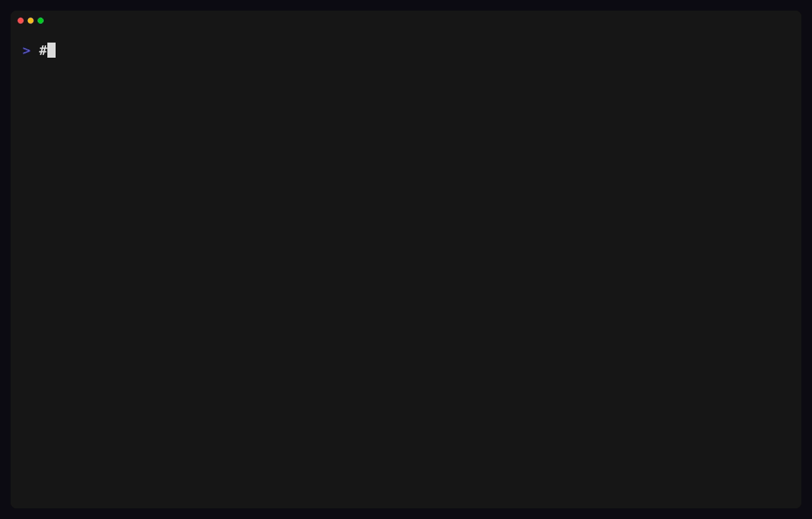
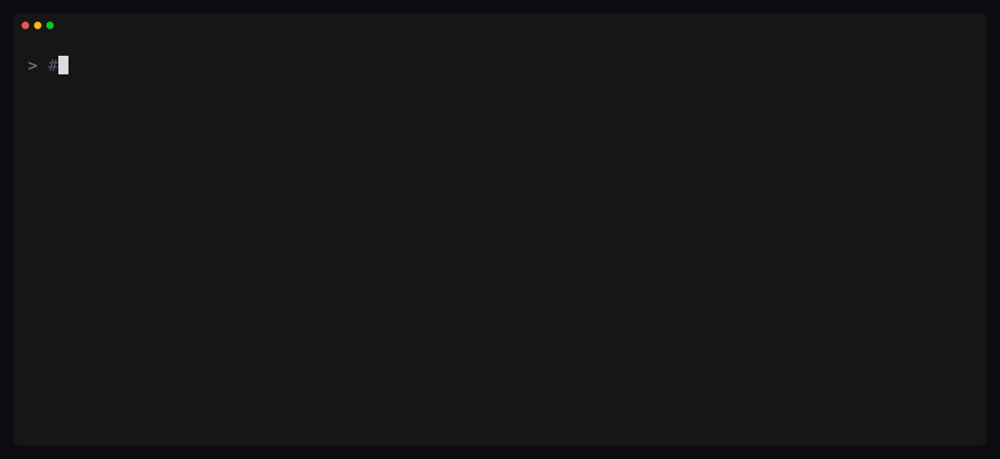
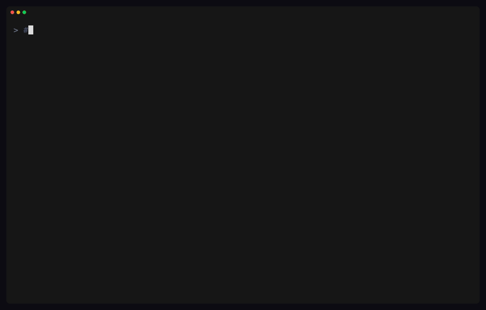

<p align="center"></p>

**Your codebase's vocabulary, enforced — and your agents can't drift it.**
Words and rulings live in a database; a tree-sitter scan checks every
named thing your code declares against them — classes, structs, functions,
types, modules, protocols — across twelve languages; a pre-write hook
corrects your coding agent before drift ever lands.

montology reads what your code *already declares* — every named thing in
Python, TypeScript, Go, Rust, Swift, Java, Ruby, Elixir, C and C++ (and,
where there is a UI, the Tailwind theme and the CSS) — and turns it into
an ontology with a gate: drift fails CI with the file, the line, and the
repair. It is a vocabulary layer for **all** of your code, not a styling
tool; a repo with no UI in it uses every part of this except the last.

```sh
# the CLI — works today, from nothing but `uv`
uvx --from "git+https://github.com/shinyobjectz/montology#subdirectory=.monty/cli" monty init

# the agent skill (Claude Code, Cursor, and friends)
npx skills add shinyobjectz/montology

# npm (the launcher)
npm install -g montology
```


[**Changelog**](CHANGELOG.md) · [Research notes](research/FINDINGS.md) ·
[Surfaces](docs/SURFACES.md)

## Sixty seconds to a drift report

```sh
cd your-repo
monty init            # .monty/, agent wiring, the pre-write guard hook
monty explain         # the X-ray: what this repo is, in one pass
monty scan --candidates   # the words your code is already asking for
monty lint            # the gate — every finding carries its repair
monty config          # what the gate enforces, and how to change it
monty intake ask …    # no words yet? the agent's `intake` skill asks the team
                      # in a form, round by round, and ends in a glossary
```

```
FAIL collision: struct 'Harness' at Sources/Runner.swift:14 is the word
     'harness' — "the thing that runs a scenario end to end". Rename it,
     or record the exception: monty onto except harness --where … --why …
FAIL divergence: type 'RowID' is declared as String (db/rows.ts:8) and as
     Int (api/rows.ts:12) — one noun, two things
warn retired: 'pointer' was RENAMED to 'cursor' (the word moved when the
     UI stopped owning it). Name it 'cursor' — the old name stays retired.
note design: rogue color #121212 ×2 (first at css/app.scss:37)
     — nearest token: ink #1b1b1f (Δ31)
```

Every finding names the file, the line and the repair. The first three
are about the CODE — a struct wearing a word that means something else, a
type declared as two different things, a name a ruling retired — and the
last is the same contract applied to a hex code, which is a word that
means one thing. If your repo has no UI you will never see that line.

Where there IS a UI, the same machinery goes further: `monty design
recipes` mines the class strings your markup repeats (`flex flex-wrap
gap-2 items-center` ×102 — on shadcn/ui's own repo) so they can become
*named* things.

## The firewall: your agent cannot write drift



Everything above is post-hoc. The guard runs **before the write**:
`monty init` installs a pre-write hook in every harness it wires
(merge-safe — `.claude/settings.json` and `.cursor/hooks.json`), and the
plugin ships its own, so a plugin install is guarded without an init. It
lints every proposed Write/Edit/NotebookEdit against the ontology in
milliseconds — a declaration named after a **retired** word
(renames are rulings; always blocks), a collision with an enforced word,
a rogue hex when tokens exist. Deny is exit 2 with the repair on stderr:
the harness feeds it straight back to the model, which corrects and
retries. The agent *physically cannot* introduce a second gray or resurrect
a renamed concept — it gets the token or the current word handed to it
mid-edit. The guard **fails open** (malformed payload, no workspace, any
internal error → allow silently) so it can never break an editor; humans
in vim never meet it. `monty doctor` says, per harness, whether it is
actually wired; `monty config guard.names block|warn|off` tunes it.

## `monty explain` — the one-shot conceptual X-ray



Point montology at any repo cold: one command composes the declared
surface, the vocabulary it has, the vocabulary it is *asking for* (with
definitions drafted on the atomic tier when one serves — law-checked,
refused over wrong), **where meanings actually gather** (semantic
clusters vs the directory tree's claimed architecture: cross-cutting
concepts, grab-bag directories), the design system as measured, and
every place the repo contradicts itself — straight to the terminal,
because an instrument prints findings, it does not decorate them.

## The part that keeps you: words

A repo's concepts drift exactly like its colors. montology's vocabulary
is a **database, not a doc** — one word, one meaning, a one-line test,
an optional dotted code — rendered into a generated agent skill and
enforced against every declaration tree-sitter can parse (python,
ts/tsx, js, go, rust, swift, elixir, ruby, java, c, c++):



```sh
monty onto check thread        # FREE / TAKEN / RULED — before naming ANYTHING
monty scan --candidates        # the words your codebase is asking for
monty onto add thread "a stateful user↔agent session" --code atl.thread --pos noun
monty onto amend thread --definition "…" --why "a later ruling narrowed it"
monty lint                     # collisions (advisory by default), code-tree
                               # integrity, stale prose — each with its repair
```

Not every symbol sharing a word's name is drift, and treating them alike
produces a list nobody reads. A word carries **what it names** — verb,
noun, or value type — and the judgment follows from it: `Store.open` is
English doing ordinary work below the surface, while a noun answering for
a second thing is the failure a vocabulary exists to prevent. A collision
you keep is a recorded decision, in the database with the rest of the
vocabulary:

```sh
monty onto except open --where "lib/**" --why "ordinary work below the surface"
monty onto except --drafts     # what an old [scan] allow list would become
```

What an exception can never do is silence a **divergence** — one
value-typed word declared as two different values (`@type name :: term()`
in one module, `@type name :: %{…}` in another). That is a separate law
with a separate line: an exception says a *symbol* may share the name, not
that the *name* may mean two things.

Rulings end arguments permanently: **overloads** ("say cell, not
sandbox"), **collisions** with frameworks (whose word it is, who moved),
and **renames** — the old name retires, old material stays readable, and
`monty migrate old new --apply` propagates the rename through the code
by *token* (tree-sitter positions, strings and comments untouched,
losslessly round-trippable — proven on eight real repos).

When a ruling narrows a word you already authored, **`monty onto amend`**
corrects the record in place: the name and its history stay, every field
that changes is ledgered with the text it replaced, and an unknown name or
a no-op is refused. Editing the database around the authoring path is the
same drift the gate exists to catch.

## Meaning over time



Three instruments make a repo's meaning a *tracked quantity*:

- **`monty vitals`** — the pulse: gate state, vocabulary state, design
  state, guard compliance → one verdict (**TENDED / DRIFTING /
  UNTENDED**) with every reason carrying its repair — plus whether the
  firewall is wired and the org upstream it inherits. `--json` is the
  dashboard shape; `--strict` exits 1 unless TENDED, so a repo can gate
  on its own tending. Track it per repo the way you track CI.
- **`monty drift`** — the telescope: the git history sampled into
  lexicon, palette and convergence curves (`--csv` for the research
  lane). First observation, excalidraw's full history: the palette
  fragmented ~10× in two years (4→11→27→42 distinct colors) while
  declarations merely doubled — and their one-off CSS-variable cleanup
  did not hold. Flask's concept lexicon, by contrast: 49 concepts in 15
  years, flat since 2019. **Convergence is a property of tending, not
  of software.**
- **`monty guard --stats`** — repair-following, measured: every hook
  denial followed by a clean edit within 30 minutes is a complied
  denial. The compliance dataset accumulates from ordinary use; every
  hooked workspace is a passive experiment in whether enforcement
  closes the literature's *text-action disconnect*.

The research notes — instruments, first measurements, prior art, open
protocols — live in [`research/FINDINGS.md`](research/FINDINGS.md), and
what has changed release to release is in [`CHANGELOG.md`](CHANGELOG.md).

## Semantic hearing


The string laws enforce *one word, one meaning*. The `[semantics]` extra
hears the dual — *one meaning, one word* — with POTION static embeddings
(~30 MB, numpy-only; no torch, no runtime): `monty onto audit` flags two
words defined into the same idea, local words that duplicate inherited
org words under different names, candidates that are secretly existing
words, and owner groupings that don't match where meanings cluster.
Advisory permanently — a cosine score proposes, only a ruling decides.

## One ontology, every repo

The org's vocabulary is authored once — any montology workspace's
`.monty/ontology.db` *is* the artifact — and inherited everywhere:



```sh
monty init --from git@github.com:acme/ontology.git    # or a path, or a .db URL
monty onto pull                                       # refresh from the pin
```

Upstream rows refresh on every pull; local words always survive; a name
defined in both places is a loud conflict (local wins — reconcile
deliberately). When the org renames a word, every repo's next pull
prints the exact `monty migrate` command: that is how a rename crosses
the fleet.

## The two models it carries (and the ones it refuses)

montology is deliberately near-modelless — the deterministic laws do the
enforcing — but it carries exactly two, each chosen for a measured floor:

| model | size | lane | what it does | what it refuses |
|---|---|---|---|---|
| **POTION** (`potion-base-8M`, model2vec) | ~30 MB, numpy-only | `[semantics]` extra | static embeddings over definitions: `onto similar`, `onto audit` — duplicate meanings, org/local doubles, misfiled clusters. Millisecond inference, no torch, no runtime. | deciding anything. A cosine score proposes; only a ruling makes vocabulary. |
| **gemma3:270m** (via Ollama, optional) | 292 MB, user-installed | `monty gen <word>` | drafts ONE-LINE definitions under the word laws (refused over written wrong) when no host agent is present — the autonomous lane. | bodies and prose. The 270M capability floor is atomic one-liners; everything longer is the host agent's work or a served endpoint (`MONTOLOGY_MODEL_URL`). |

Nothing heavier ships, ever: no torch, no onnxruntime, no bundled
weights. The host agent (Claude, Cursor, Codex) is always the best
drafter available, and the gate never needs a model at all.

## For agents

`monty init` wires the repo for Claude Code, Cursor, and Codex
(merge-safe: sections are appended, JSON keys merged, global config never
touched) — MCP server, the instructions section, and the pre-write guard
hook in each harness's own dialect. `monty doctor` reports which of those
actually landed.

Two skills ship: **`montology`** routes the work (new repo → set up,
empty vocabulary → build one, working repo → the check-first contract),
and **`intake`** runs the guided walkthrough for a codebase whose words
were never written down. The generated **`words`** skill carries the whole
vocabulary — words, tokens, recipes, rulings, doctrine — tiering into
reference pages rather than truncating when it outgrows its budget.

The MCP server exposes `ontology_check`, `ontology_add`, `ontology_amend`,
`ontology_rule`, `ontology_similar`, `ontology_words`, `ontology_lint`,
`scan_surface`, `scan_candidates`, `structural_search`, `repo_explain`,
`repo_vitals` and `workspace_config`. Prose is rendered from the database,
never authored; a stale render fails the build.

## Under the hood

tree-sitter (via `tree-sitter-language-pack`) measures declarations and
CSS structurally; ast-grep (invoked, one static binary) powers
structural pattern search; SQLite holds the vocabulary. The stress
battery (`stress/run.py`, weekly in CI) proves four properties on eight
real repos — flask, excalidraw, gin, ripgrep, phoenix, sinatra,
spring-petclinic, redis: merge-safe idempotent init, zero-error parsing,
truthful collision reporting, and lossless migrate round-trips.

## Contributors

```sh
git clone https://github.com/shinyobjectz/montology && cd montology
uv sync && just              # the action surface
just check                   # the gate (montology lints itself, strictly:
                             # its own toml sets collisions = "enforce")
```

Changes go in [`CHANGELOG.md`](CHANGELOG.md) under `Unreleased`. The
marketing-era codebase montology grew out of lives at the
[`marketing-era`](https://github.com/shinyobjectz/montology/tree/marketing-era)
tag and shares no code with this one.
